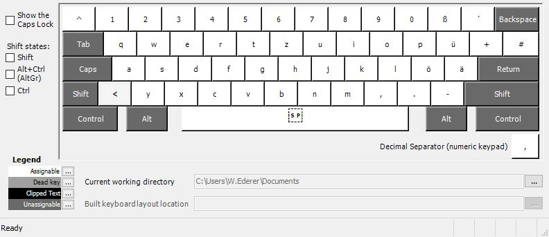

# DE Keyboard Layout for Developers

My german keyboard layout which makes using brackets, braces, ... easy via the AltGr button near the homerow.

Run `Deutsch_WEdererv0.4.0.klc` to install the layout.

With alt gr pressed:

