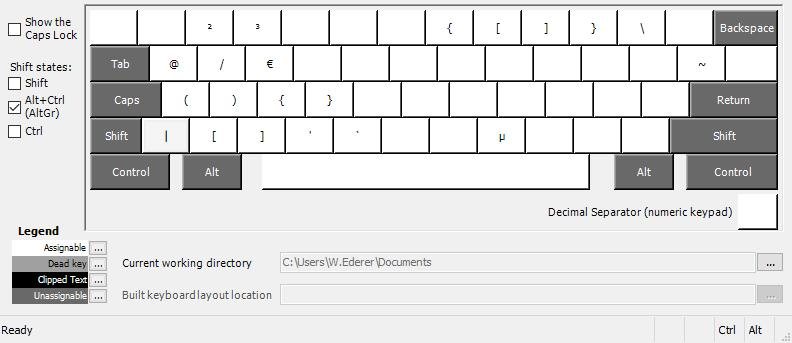

# DE Keyboard Layout for Developers

My german keyboard layout which makes using brackets, braces, ... easy via the AltGr button near the homerow.

Created by using the [Keyboard Layout Creator](https://www.microsoft.com/en-us/download/details.aspx?id=22339).

## Layout (`Alt Gr` pressed)

## How to use
1. Run `Deutsch_WEdererv0.4.0.klc` to install the layout.
1. Switch to new Layout
